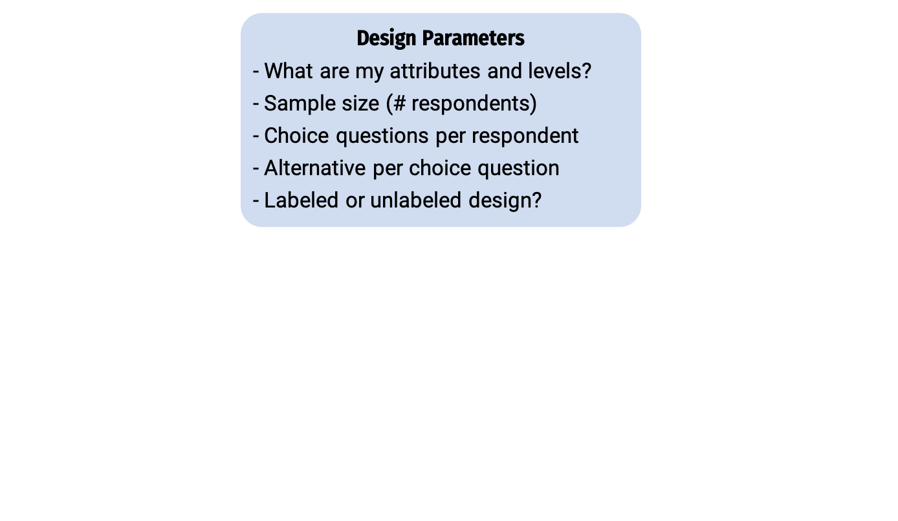
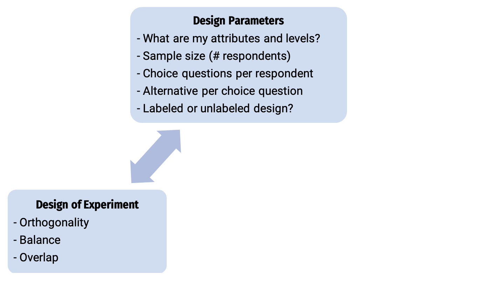
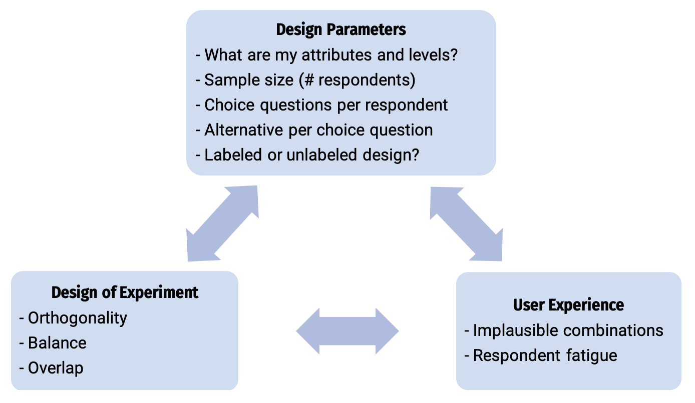
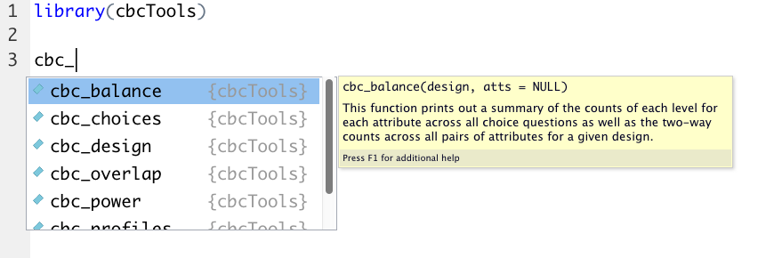
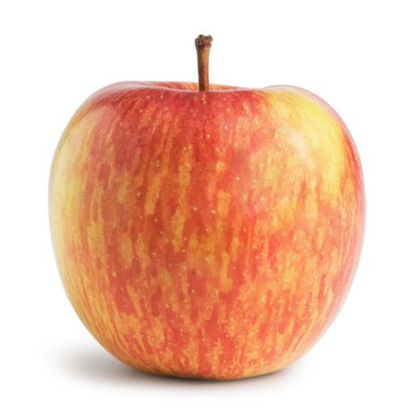

```{r setup, include=FALSE}
library(knitr)
library(fontawesome)
library(tidyverse)
library(metathis)
library(logitr)
library(cbcTools)

options(
    htmltools.dir.version = FALSE,
    knitr.table.format = "html",
    knitr.kable.NA = '',
    dplyr.width = Inf,
    width = 250
)
knitr::opts_chunk$set(
    warning = FALSE,
    message = FALSE,
    fig.path = "figs/",
    fig.width = 7.252,
    fig.height = 4,
    comment = "#>",
    fig.retina = 3
)

# Setup xaringanExtra options
xaringanExtra::use_xaringan_extra(c(
  "tile_view", "panelset", "share_again"))
xaringanExtra::style_share_again(share_buttons = "none")
xaringanExtra::use_extra_styles(
  hover_code_line = TRUE,
  mute_unhighlighted_code = FALSE
)

# Set up website metadata
meta() %>%
  meta_general(
    description = rmarkdown::metadata$subtitle,
    generator = "xaringan and remark.js"
  ) %>%
  meta_name("github-repo" = "jhelvy/2023-qux-conf-conjoint") %>%
  meta_social(
    title = rmarkdown::metadata$title,
    url = "https://jhelvy.github.io/2023-qux-conf-conjoint/",
    og_type = "website",
    og_author = "John Paul Helveston",
    twitter_card_type = "summary_large_image",
    twitter_creator = "@johnhelveston"
  )
```

layout: true

---

class: middle, inverse

.leftcol40[

<center>

</center>

]

.rightcol60[

### `r fontawesome::fa(name = "user", fill = "white")` `r rmarkdown::metadata$author`
### `r fontawesome::fa(name = "university", fill = "white")` `r rmarkdown::metadata$institute`
### `r fontawesome::fa(name = "calendar-alt", fill = "white")` `r rmarkdown::metadata$date`

]

---

class: center

### Designing a Choice-Based Conjoint Survey is Hard

--

<center>

</center>

---

class: center

### Designing a Choice-Based Conjoint Survey is Hard

<center>

</center>

---

class: center

### Designing a Choice-Based Conjoint Survey is Hard

<center>

</center>

---

# .center[A simple conjoint experiment about _cars_]

Attribute | Levels
----------|----------
Brand     | GM, BMW, Ferrari
Price     | $20k, $40k, $100k

.center[**Design: .red[9] choice sets, .blue[3] alternatives each**]

--

.leftcol[

```
Attribute counts:

brand:
  GM   BMW  Ferrari 
  10    11    6 

price:

 20k  40k 100k 
  9    9   9
```

]

--

.rightcol[

```
Pairwise attribute counts:

brand & price:
         
          20k 40k 100k
  GM        3   0    7
  BMW       4   5    2
  Ferrari   2   4    0
```

]

---

# .center[A simple conjoint experiment about _cars_]

Attribute | Levels
----------|----------
Brand     | GM, BMW, Ferrari
Price     | $20k, $40k, $100k

.center[**Design: .red[90] choice sets, .blue[3] alternatives each**]

--

.leftcol[

```
Attribute counts:

brand:
  GM    BMW   Ferrari 
  92    80     98

price:

  20k  40k 100k 
  91   84   95 
```

]

--

.rightcol[

```
Pairwise attribute counts:

brand & price:
         
          20k 40k 100k
  GM      31  31  30
  BMW     25  25  30
  Ferrari 35  28  35
```

]

---

# .center[Bayesian D-efficient designs]

### .center[Maximize information on "Main Effects" according to priors]

Attribute | Levels | Prior
----------|-------------------|----------
Brand     | GM, BMW, Ferrari  | 0, 1, 2
Price     | $20k, $40k, $100k | 0, -1, -4

--

.leftcol[

```
Attribute counts:

brand:
  GM    BMW   Ferrari 
  93    90     86

price:

  20k  40k 100k 
  97   93   78
```

]

--

.rightcol[

```
Pairwise attribute counts:

brand & price:
         
          20k 40k 100k
  GM      52  41  0
  BMW     30  30  30
  Ferrari 15  22  49
```

]

---

# .center[But what about other factors?]

<br>

- What if I add one more choice question to each respondent?

--

- What if I increase the number of alternatives per choice question?

--

- What if I use a labeled design (aka "alternative-specific design")?

--

- What if I include a "none" option (aka "outside good")?

--

- What if there are interaction effects?

---

class: middle, center, inverse 

# The `{cbcTools}` Package 

<center>

</center>

---

background-image: url("images/process.png")

## .center[Systematic workflow for designing a cbc experiment]

---

background-image: url("images/process_labels.png")

## .center[Systematic workflow for designing a cbc experiment]

---

class: center, middle 
background-image: url("images/process_labels.png")

.border[
<center>

</center>
]

---

background-image: url("images/process_levels.png")

---

background-color: #fff

## .center[Define the attributes and levels]

.leftcol30[

<center>

</center>

]

.rightcol70[

<br>

- **Price ($/lb)**: 1.00, 1.50, 2.00, 2.50, 3.00, 3.50, 4.00
- **Type**: Fuji, Gala, Honeycrisp
- **Freshness**: Excellent, Average, Poor

]

---

class: center
background-color: #fff

## Define the attributes and levels

Example choice question

<center>

</center>

---

background-image: url("images/process_profiles.png")

---

# .center[Generate all possible profiles]

<br>

```{r}
profiles <- cbc_profiles(
  price     = seq(1, 4, 0.5), # $ per pound
  type      = c('Fuji', 'Gala', 'Honeycrisp'),
  freshness = c('Poor', 'Average', 'Excellent')
)
```

--

.leftcol[

```{r}
head(profiles)
```

]

.rightcol[

```{r}
tail(profiles)
```

]

---

## .center[Generate a restricted set of profiles?]

--

> CAUTION: including restrictions in your designs can substantially reduce the statistical power of your design, so use them cautiously (and avoid them if possible).

--

```{r}
restricted_profiles <- cbc_restrict(
    profiles,
    type == "Gala" & price %in% c(1.5, 2.5, 3.5),
    type == "Honeycrisp" & price < 2,
    type == "Fuji" & freshness == "Poor"
)

dim(restricted_profiles)
```

---

background-image: url("images/process_design.png")

---

# .center[Generate a survey design]

```{r}
design <- cbc_design( 
  profiles = profiles,
  n_resp   = 300, # Number of respondents
  n_alts   = 3,   # Number of alternatives per question
  n_q      = 6    # Number of questions per respondent
)
```

--

```{r}
head(design)
```

---

# .center[Include a "no choice" option]

```{r}
design <- cbc_design(
  profiles  = profiles,
  n_resp    = 300, # Number of respondents
  n_alts    = 3,   # Number of alternatives per question
  n_q       = 6,    # Number of questions per respondent
  no_choice = TRUE #<<
)
```

--

```{r}
head(design)
```

---

## .center[Make a labeled design]

.center[.font100[(aka "alternative-specific design")]]

```{r}
design <- cbc_design(
  profiles = profiles,
  n_resp   = 300, # Number of respondents
  n_alts   = 3,   # Number of alternatives per question
  n_q      = 6,    # Number of questions per respondent
  label    = "type" #<<
)
```

--

```{r}
head(design)
```

---

# .center[Make a Bayesian D-efficient design]

### .center[(Uses the [`idefix`](https://www.jstatsoft.org/article/view/v096i03) package to generate a design)]

```{r, eval=FALSE}
design <- cbc_design(
  profiles = profiles,
  n_resp   = 300, # Number of respondents
  n_alts   = 3,   # Number of alternatives per question
  n_q      = 6,   # Number of questions per respondent
  priors = list( #<< 
    price     = -0.1, # Numeric, modeled as continuous #<< 
    type      = c(0.1, 0.2), # Reference level: "Fuji" #<< 
    freshness = c(0.1, 0.2) # Reference level: "Poor" #<< 
  ) #<< 
)
```

Priors are defining the following model:

$$
u_j = -0.1p_j + 0.1t^{Gala}_j + 0.2t^{Honeycrisp}_j + 0.1f^{Ave}_j + 0.2f^{Excellent}_j + \varepsilon_j
$$

---

# .center[Import a design: .blue[Sawtooth] `r fa("arrow-right", fill = "blue")` `r fa("file-csv", fill = "blue")` `r fa("arrow-right", fill = "blue")` `r fa("r-project", fill = "blue")`]

```{r}
#| eval: false 

library(readr)

design <- read_csv('design.csv')

head(design)
```

```{r}
#| echo: false 

head(design |> select(-profileID))
```

---

background-image: url("images/process_inspect.png")

---

# .center[Check design **balance**]

```{r, eval=FALSE}
cbc_balance(design)
```

--

.leftcol[

```
Individual attribute level counts

price:

  1 1.5   2 2.5   3 3.5   4 
784 755 759 741 776 827 758 

type:

      Fuji       Gala Honeycrisp 
      1800       1800       1800 

freshness:

     Poor   Average Excellent 
     1845      1767      1788 
```

]

--

.rightcol[

```
Pairwise attribute level counts

price x type:

        Fuji Gala Honeycrisp
     NA 1800 1800       1800
1   784  260  256        268
1.5 755  248  254        253
2   759  259  240        260
2.5 741  239  254        248
3   776  263  286        227
3.5 827  264  258        305
4   758  267  252        239
```

]

---

# .center[Check design **overlap**]

```{r, eval=FALSE}
cbc_overlap(design)
```

--

.leftcol[

```
Counts of attribute overlap:
(# of questions with N unique levels)

price:

     1    2    3 
    31  630 1139 

type:

     1    2    3 
   156 1248  396 

freshness:

     1    2    3 
   175 1189  436 
```

]

---

background-image: url("images/process_choices.png")

---

# .center[Simulate random choices]

```{r}
data <- cbc_choices(
  design = design,
  obsID  = "obsID"
)
```

--

```{r}
head(data)
```

---

## .center[Simulate choices according to a prior]

.center[(Fixed coefficients)]

.leftcol[

```{r}
data <- cbc_choices(
  design = design,
  obsID = "obsID",
  priors = list( #<< 
    price     = -0.1, #<< 
    type      = c(0.1, 0.2), #<< 
    freshness = c(0.1, -0.2) #<< 
  ) #<< 
)
```

]

.rightcol[

Attribute | Level | Utility 
----------|-----------
**Price** | Continuous | -0.1
**Type**  | Fuji | 0
          | Gala | 0.1
          | Honeycrisp  | 0.2
**Freshness**  | Average | 0
               | Excellent | 0.1
               | Poor  | -0.2

]

---

## .center[Simulate choices according to a prior]

.center[(Random coefficients...currently supports Normal & Log-normal)]

.leftcol[

```{r, eval=FALSE}
data <- cbc_choices(
  design = design,
  obsID = "obsID",
  priors = list(  
    price = -0.1, 
    type = randN(  #<<
      mu    = c(0.1, 0.2), #<<
      sigma = c(0.5, 1) #<< 
    ), #<<
    freshness = c(0.1, -0.2) 
  ) 
)
```

]

.rightcol[

Attribute | Level | Utility 
----------|-----------
**Price** | Continuous | -0.1
**Type**  | Fuji | 0
          | Gala | N(0.1, 0.5)
          | Honeycrisp  | N(0.2, 1)
**Freshness**  | Average | 0
               | Excellent | 0.1
               | Poor  | -0.2

]

---

## .center[Simulate choices according to a prior]

.center[(Models with interactions)]

.leftcol[

```{r, eval=FALSE}
data <- cbc_choices(
  design = design,
  obsID = "obsID",
  priors = list( 
    price     = -0.1, 
    type      = c(0.1, 0.2), 
    freshness = c(0.1, -0.2),
    "price*type" = c(0.1, 0.5) #<<
  ) 
)
```

]

.rightcol[

Attribute | Level | Utility 
----------|-----------
**Price** | Continuous | -0.1
**Type**  | Fuji | 0
          | Gala | 0.1
          | Honeycrisp  | 0.2
**Freshness**  | Average | 0
               | Excellent | 0.1
               | Poor  | -0.2
**Price x Type**  | Fuji | 0
          | Gala | 0.1
          | Honeycrisp  | 0.5

]

---

background-image: url("images/process_power.png")

---

# .center[Conduct a power analysis]

```{r}
power <- cbc_power(
    nbreaks = 10,
    n_q     = 6,
    data    = data,
    obsID   = "obsID",
    outcome = "choice",
    pars    = c("price", "type", "freshness")
)
```

--

.leftcol[

```{r}
head(power)
```

]

.rightcol[

```{r}
tail(power)
```

]

---

# .center[Conduct a power analysis]

```{r, fig.width=8, fig.height=5}
plot(power)
```

---

# .center[Conduct a power analysis]

.leftcol[

```{r}
power_int <- cbc_power(
    nbreaks = 10,
    n_q     = 6,
    data    = data,
    pars    = c(
      "price", 
      "type", 
      "freshness", 
      "price*type" #<<
    ), 
    outcome = "choice",
    obsID   = "obsID"
)
```

]

.rightcol[

```{r, fig.width=8, fig.height=5}
plot(power_int)
```

]

---

background-image: url("images/process_labels.png")

<center>

</center>

---

background-image: url("images/sawtooth-cbcTools.png")

---

background-color: #fff
background-image: url("images/cbcTools-sawtooth.png")
background-position: center
background-size: contain

---

class: inverse

<br>

## .center[Back to workshop website:<br><br> https://jhelvy.github.io/2023-qux-conf-conjoint/]

.footer-large[

.right[

@JohnHelveston `r fa(name = "twitter", fill = "white")`<br>
@jhelvy `r fa(name = "github", fill = "white")`<br>
@jhelvy `r fa(name = "weixin", fill = "white")`<br>
jhelvy.com `r fa(name = "link", fill = "white")`<br>
jph@gwu.edu `r fa(name = "paper-plane", fill = "white")`

]]
