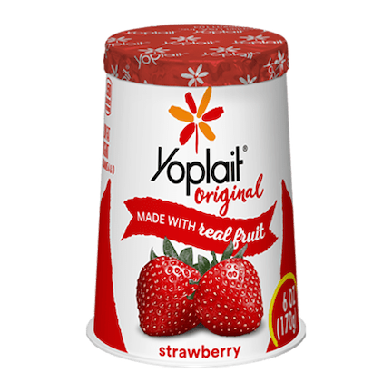

```{r setup, include=FALSE}
library(knitr)
library(fontawesome)
library(tidyverse)
library(metathis)
library(qs)
library(logitr)

options(
  htmltools.dir.version = FALSE,
  knitr.table.format = "html",
  knitr.kable.NA = '',
  dplyr.width = Inf,
  width = 250
)

knitr::opts_chunk$set(
  cache = FALSE,
  warning = FALSE,
  message = FALSE,
  fig.path = "figs/",
  fig.width = 7.252,
  fig.height = 4,
  comment = "#>",
  fig.retina = 3
)

# Setup xaringanExtra options
xaringanExtra::use_xaringan_extra(c(
  "tile_view", "panelset", "share_again"))
xaringanExtra::style_share_again(share_buttons = "none")
xaringanExtra::use_extra_styles(
  hover_code_line = TRUE,
  mute_unhighlighted_code = FALSE
)

# Set up website metadata
meta() %>%
  meta_general(
    description = rmarkdown::metadata$subtitle,
    generator = "xaringan and remark.js"
  ) %>%
  meta_name("github-repo" = "jhelvy/2023-qux-conf-conjoint") %>%
  meta_social(
    title = rmarkdown::metadata$title,
    url = "https://jhelvy.github.io/2023-qux-conf-conjoint/",
    og_type = "website",
    og_author = "John Paul Helveston",
    twitter_card_type = "summary_large_image",
    twitter_creator = "@johnhelveston"
  )

# Read in results from estimated models
mnl_pref <- qread(here::here("models", "mnl_pref.qs"))
mnl_wtp <- qread(here::here("models", "mnl_wtp.qs"))
mnl_wtp_multi <- qread(here::here('models', 'mnl_wtp_multi.qs'))
mxl_pref <- qread(here::here("models", "mxl_pref1.qs"))
mxl_wtp <- qread(here::here("models", "mxl_wtp.qs"))
```

layout: true

---

class: middle, inverse

## .center[`r rmarkdown::metadata$title`]

.leftcol40[

<center>

</center>

]

.rightcol60[

### `r fontawesome::fa(name = "user", fill = "white")` `r rmarkdown::metadata$author`
### `r fontawesome::fa(name = "university", fill = "white")` `r rmarkdown::metadata$institute`
### `r fontawesome::fa(name = "calendar-alt", fill = "white")` `r rmarkdown::metadata$date`

]

---

# Many FOSS options model estimation

R packages:

- [{logitr}](https://github.com/jhelvy/logitr): Fastest, mixed logit, WTP space.
- [{apollo}](http://www.apollochoicemodelling.com/): Most flexible, great documentation.
- [{mlogit}](https://www.jstatsoft.org/article/view/v095i11): The OG R package.
- [{gmnl}](https://www.jstatsoft.org/article/view/v079i02): Generalized logit model (though slow).
- [{mixl}](https://github.com/joemolloy/fast-mixed-mnl): Good for big datasets (uses C for speed).

Python packages:

- [{xlogit}](https://xlogit.readthedocs.io/en/latest/): Basically Python version of {logitr}.

[Stan](https://www.inwt-statistics.com/blog/understand-customer-decision-making-discrete-choice-models-with-rstan): For the Bayesians.

---

# Many FOSS options model estimation

R packages:

- [{logitr}](https://github.com/jhelvy/logitr): Fastest, mixed logit, WTP space. .red[<- I wrote this one, so I'm showcasing it!]
- [{apollo}](http://www.apollochoicemodelling.com/): Most flexible, great documentation.
- [{mlogit}](https://www.jstatsoft.org/article/view/v095i11): The OG R package.
- [{gmnl}](https://www.jstatsoft.org/article/view/v079i02): Generalized logit model (though slow).
- [{mixl}](https://github.com/joemolloy/fast-mixed-mnl): Good for big datasets (uses C for speed).

Python packages:

- [{xlogit}](https://xlogit.readthedocs.io/en/latest/): Basically Python version of {logitr}.

[Stan](https://www.inwt-statistics.com/blog/understand-customer-decision-making-discrete-choice-models-with-rstan): For the Bayesians.

---

class: center
background-color: #fff

## {logitr} is fast!

<center>

</center>

---

class: center

## {logitr} supports two common forms of utility models

.leftcol[

## Preference Space

<center>

</center>

]

.rightcol[

## WTP Space

<center>

</center>

]

---

## .center[{logitr} has a similar UI with {cbcTools}]

.center[({cbcTools} uses {logitr} to simulate choices and assess power)]

.leftcol[

## .center[{cbcTools}]

```{r}
#| eval: false

power <- cbc_power(
    nbreaks = 10,
    n_q     = 6,
    data    = data,
    obsID   = "obsID",
    outcome = "choice",
    pars    = c("price", "type", "freshness")
)
```

]

.rightcol[

## .center[{logitr}]

```{r}
#| eval: false

model <- logitr(
    data    = data,
    obsID   = "obsID",
    outcome = "choice",
    pars    = c("price", "type", "freshness")
)
```

]

---

class: inverse, middle, center

# Utility model refresher

---

class: center

# Which would you choose?

.cols4[

## .center[$2.49]

<center>

</center>

]

.cols4[

## .center[$2.99]

<center>

</center>

]

.cols4[

## .center[$1.99]

<center>

</center>

]

.cols4[

## .center[$3.99]

<center>

</center>

]

---

# .center[Estimate marginal utilities]

</br>

<center>

</center>

--

.code100[

```{r}
#| echo: false

coef(summary(mnl_pref))
```

]

---

# .center[Convert marginal _utilities_ to marginal _WTPs_]

</br>

<center>

</center>

--

.code100[

```{r}
#| echo: false

wtp_mnl_pref <- wtp(mnl_pref, scalePar = 'price')
wtp_mnl_pref[2:4,]
```

]

---

class: center

## Alternative approach: **Estimate a WTP-Space Model**

.leftcol30[

## Substitutions:

<center>
</br>

</center>

]

.rightcol70[

## "Preference Space"

<center>

</center>

## "WTP Space"

<center>

</center>

]

---

class: center, middle, inverse

# What's the difference?

.leftcol[

## Preference Space

<center>

</center>

.font200[&darr;]

<center>
</br>
</center>

]

.rightcol[

## WTP Space

</br></br>
<center>

</center>

]

---

class: center 

## **Mixed logit**:
## Unreasonably large WTP variance across population

</br>

.leftcol40[

<center>

</center>

.center[.font200[&darr;]]

<center>
</br>
</center>

]

.rightcol60[

<center>

</br>

</center>

]

---

background-color: #fff
class: center

### Preference space model produces unreasonably large variance in WTP

.cols4[&zwj;]

.cols4[

<center>
<b>Preference Space</b>

</center>

]

.cols4[

<center>
<b>WTP Space</b>

</center>
</br>

]

.cols4[&zwj;]

--

<center>

</center>

---

class: center, middle, inverse

# .fancy[Practical Considerations]

---

class: center 

## .fancy[Practical Considerations]

> ### WTP space models produce immediately interpretable results

--

.leftcol[

Unit: "Utility" (relative)

<center>

</center>

.code50[

```{r}
#| echo: false

coef(summary(mnl_pref))
```

]]

--

.rightcol[

Units: $ (absolute)

<center>

</center>

.code50[

```{r}
#| echo: false

wtp_mnl_pref
```

]]

---

class: center 

## .fancy[Practical Considerations]

> ### WTPs can be directly compared across different models</br>(even estimates from different data sets)

--

<center>

</center>

--

.leftcol[

**Preference Space**</br>Parameters proportional to $\sigma$

<center>


</center>

]

--

.rightcol[

**WTP Space**</br>Parameters independent of $\sigma$

<center>


</center>

]

---

## .center[.fancy[Practical Considerations]]

> ### .center[Neither space systematically predicts choice better]

.leftcol80[

-  **Train and Weeks (2005)** and **Sonnier et al. (2007)** found preference space model fit data better.

- **Das et al. (2009)** found nearly identical model fit on out-of-sample predictions with each model specification.

]

---

class: center, middle, inverse

# ...but most software is built for 

<center>

</center>

# not

<center>

</center>

---

class: center, middle, inverse 

# `logitr` to the rescue!

<center>

</center>

---

# The logitr `r fa("r-project", fill = "#165CAA")` Package <a href='https://jhelvy.github.io/logitr/'></a>

### Estimation of multinomial and mixed logit models in with "Preference" space or "Willingness-to-pay" (WTP) space utility parameterizations.

- Multinomial logit (MNL) models
- Mixed logit (MXL) models with normal and log-normal parameter
  distributions.
- Preference space and WTP space utility parameterizations.
- Weighted models to differentially weight individual observations.
- Uncorrelated or correlated heterogeneity covariances for mixed logit
  models.
- Functions for computing WTP from preference space models.
- Functions for predicting expected probabilities and outcomes for sets
  of alternatives based on an estimated model.
- A parallelized multistart optimization loop that uses different random
  starting points in each iteration to search for different local minima
  (useful for non-convex problems like MXL models or models with WTP
  space parameterizations).

---

# .center[Data format]

Data must be arranged in a "long" format: 

- Each row is an alternative from a choice observation. 
- Choice observations do _not_ have to be symmetric. 

Required variables: 

- `outcome`: A dummy variable for the chosen alternative (`1` or `0`).
- `obsID`: A sequence of repeated numbers identifying each unique choice observation, e.g. `1, 1, 2, 2, 3, 3`.
- `pars`: Any other variables to use as model covariates.

---

# .center[Data format]

.leftcol[

```{r}
#| eval: false

head(yogurt, 10)
```

```{r}
#| echo: false

yogurt %>% 
  select(choice, obsID, alt, price, brand) %>% 
  head(10) %>% 
  as.data.frame()
```

]

.rightcol[

- `outcome = "choice"`
- `obsID = "obsID"`
- `pars = c("price", "brand")`

]

---

# .center[Multinomial logit in **Preference Space**]

.leftcol45[

```{r}
#| eval: false

mnl_pref <- logitr(
  data    = yogurt,
  outcome = "choice",
  obsID   = "obsID",
  pars    = c("price", "brand")
)

summary(mnl_pref) #<<
```

<center>

</center>

]

--

.rightcol55[.code50[

```{r}
#| echo: false

summary(mnl_pref)
```

]]

---

# .center[Multinomial logit in **WTP Space**]

.leftcol45[

```{r}
#| eval: false

library(logitr)

mnl_wtp <- logitr(
  data     = yogurt,
  outcome  = "choice",
  obsID    = "obsID",
  pars     = "brand", #<<
  scalePar = "price" #<<
)

summary(mnl_wtp)
```

<center>

</center>

]

--

.rightcol55[.code50[

```{r}
#| echo: false

summary(mnl_wtp)
```

]]

---

class: center, middle

## **.red[Caution]**</br>

## Log-likelihood function for WTP space models is</br>**non-convex**  😔

---

# .center[Use a Multistart]

.leftcol45[

```{r}
#| eval: false

mnl_wtp <- logitr(
  data     = yogurt,
  outcome  = "choice",
  obsID    = "obsID",
  pars     = "brand",
  scalePar = "price",
  numMultiStarts = 10 #<<
)

summary(mnl_wtp)
```

<center>

</center>

]

--

.rightcol55[.code50[

```{r}
#| echo: false

summary(mnl_wtp_multi)
```

]]

---

.leftcol[

## .center[Mixed logit in<br>**Preference Space**]

```{r}
#| eval: false

mxl_pref <- logitr(
  data     = yogurt,
  outcome  = "choice",
  obsID    = "obsID",
  pars     = c("price", "brand"),
  randPars = c(brand = "n"), #<<
  numMultiStarts = 10
)
```

<center>


</center>

]

.rightcol[

## .center[Mixed logit in<br>**WTP Space**]

```{r}
#| eval: false

mxl_wtp <- logitr(
  data     = yogurt,
  outcome  = "choice",
  obsID    = "obsID",
  pars     = "brand",
  scalePar = "price",
  randPars = c(brand = "n"), #<<
  randScale = "ln", #<<
  numMultiStarts = 10
)
```

<center>


</center>

]

---

class: center, middle, inverse

# .fancy[Convenient helper functions]

---

### .center[`predict()`: Expected shares for a set of alternatives]

</br>

.leftcol[

Define a set of alternatives

```{r}
#| eval: false

data <- subset(
  yogurt, obsID == 42, 
  select = c('price', 'brand', 'obsID'))

data
```

```{r}
#| echo: false

yogurt$brand <- factor(yogurt$brand, levels = c(
  "weight", "hiland", "yoplait", "dannon"))

data <- as.data.frame(subset(
  yogurt, obsID == 42, 
  select = c('price', 'brand', 'obsID')))

row.names(data) <- seq(4)

data
```

]

--

.rightcol[

Predict probabilities

```{r}
predict(
  mnl_pref,
  newdata = data,
  obsID = "obsID", 
  returnData = TRUE
)
```

]

---

class: inverse

# Your turn

- Download the practice zip file for this section.
- Open the `estimating-models.Rproj` file to open RStudio.
- In RStudio, open the `practice.R` file.
- Experiment with estimating different models (use either one of the example datasets included in the package, or simulate your own data!)

---

class: inverse

<br>

## .center[{logitr} documentation:<br>https://jhelvy.github.io/logitr/]

## .center[Back to workshop website:<br> https://jhelvy.github.io/2023-qux-conf-conjoint/]

.footer-large[

.right[

@JohnHelveston `r fa(name = "twitter", fill = "white")`<br>
@jhelvy `r fa(name = "github", fill = "white")`<br>
@jhelvy `r fa(name = "weixin", fill = "white")`<br>
jhelvy.com `r fa(name = "link", fill = "white")`<br>
jph@gwu.edu `r fa(name = "paper-plane", fill = "white")`

]]
