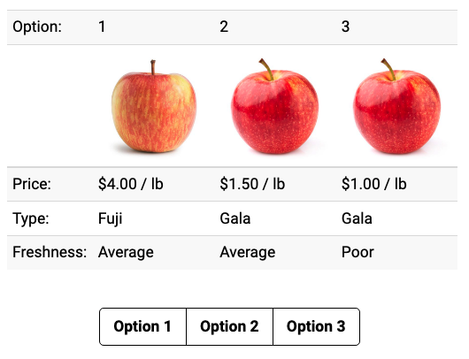

```{r setup, include=FALSE}
library(knitr)
library(tidyverse)
library(fontawesome)
library(metathis)
library(cbcTools)

options(
  htmltools.dir.version = FALSE,
  knitr.table.format = "html",
  knitr.kable.NA = '',
  dplyr.width = Inf,
  width = 250
)

knitr::opts_chunk$set(
  cache = FALSE,
  warning = FALSE,
  message = FALSE,
  fig.path = "figs/",
  fig.width = 7.252,
  fig.height = 4,
  comment = "#>",
  fig.retina = 3
)

# Setup xaringanExtra options
xaringanExtra::use_xaringan_extra(c(
  "tile_view", "panelset", "clipboard", "share_again"))
xaringanExtra::style_share_again(share_buttons = "none")
xaringanExtra::use_extra_styles(
  hover_code_line = TRUE,
  mute_unhighlighted_code = FALSE
)

# Set up website metadata
meta() %>%
  meta_general(
    description = rmarkdown::metadata$subtitle,
    generator = "xaringan and remark.js"
  ) %>%
  meta_name("github-repo" = "jhelvy/2023-qux-conf-conjoint") %>%
  meta_social(
    title = rmarkdown::metadata$title,
    url = "https://jhelvy.github.io/2023-qux-conf-conjoint/",
    og_type = "website",
    og_author = "John Paul Helveston",
    twitter_card_type = "summary_large_image",
    twitter_creator = "@johnhelveston"
  )

# make design

# Define profiles with attributes and levels

profiles <- cbc_profiles(
    price       = c(15, 20, 25), # Price ($1,000)
    fuelEconomy = c(20, 25, 30), # Fuel economy (mpg)
    accelTime   = c(6, 7, 8),    # 0-60 mph acceleration time (s)
    powertrain  = c("Gasoline", "Electric")
)

# Make a full-factorial design of experiment

design <- cbc_design(
    profiles = profiles,
    n_resp   = 500, # Number of respondents
    n_alts   = 3,   # Number of alternatives per question
    n_q      = 8    # Number of questions per respondent
)
# Make a labeled full-factorial design of experiment

design_labeled <- cbc_design(
    profiles = profiles,
    n_resp   = 500, # Number of respondents
    n_alts   = 2,   # Number of alternatives per question
    n_q      = 8,   # Number of questions per respondent
    label    = "powertrain"
)

# Make a survey with no choice option

design_nochoice <- cbc_design(
    profiles = profiles,
    n_resp   = 500, # Number of respondents
    n_alts   = 3,   # Number of alternatives per question
    n_q      = 8,   # Number of questions per respondent
    no_choice = TRUE
)

design_short <- design %>%
  mutate(
    price = scales::dollar(price),
    fuelEconomy = paste0(fuelEconomy, " (mpg)"),
    accelTime = paste0(accelTime, " (s)")
  ) %>% 
  select(
    respID, qID,
    `Option:` = altID, 
    `Price:` = price, 
    `Fuel Economy:` = fuelEconomy, 
    `Accel. Time:` = accelTime, 
    `Powertrain:` = powertrain
  )
design_labeled_short <- design_labeled %>%
  mutate(
    price = scales::dollar(price),
    fuelEconomy = paste0(fuelEconomy, " (mpg)"),
    accelTime = paste0(accelTime, " (s)")
  ) %>% 
  select(
    respID, qID,
    `Option:` = powertrain, 
    `Price:` = price, 
    `Fuel Economy:` = fuelEconomy, 
    `Accel. Time:` = accelTime
  )
design_nochoice_short <- design_nochoice %>%
  mutate(
    price = scales::dollar(price),
    fuelEconomy = paste0(fuelEconomy, " (mpg)"),
    accelTime = paste0(accelTime, " (s)"),
    price = ifelse(altID == 4, "", price),
    fuelEconomy = ifelse(altID == 4, "", fuelEconomy),
    accelTime = ifelse(altID == 4, "", accelTime),
    powertrain = ifelse(powertrain_Electric == 1, "Electric", "Gasoline"),
    powertrain = ifelse(altID == 4, "", powertrain),
    altID = ifelse(altID == 4, "None", altID)
  ) %>% 
  select(
    respID, qID,
    `Option:` = altID, 
    `Price:` = price, 
    `Fuel Economy:` = fuelEconomy, 
    `Accel. Time:` = accelTime, 
    `Powertrain:` = powertrain
  )
row.names(design_nochoice_short) <- seq(nrow(design_nochoice_short))
design_q1 <- design_short %>%
  filter(respID == 1, qID == 1) %>% 
  select(-respID, -qID)
design_q2 <- design_short %>%
  filter(respID == 1, qID == 2) %>% 
  select(-respID, -qID)
design_labeled_q1 <- design_labeled_short %>%
  filter(respID == 1, qID == 1) %>% 
  select(-respID, -qID)
design_labeled_q2 <- design_labeled_short %>%
  filter(respID == 1, qID == 2) %>% 
  select(-respID, -qID)
design_nochoice_q1 <- design_nochoice_short %>%
  filter(respID == 1, qID == 1) %>% 
  select(-respID, -qID)
design_nochoice_q2 <- design_nochoice_short %>%
  filter(respID == 1, qID == 2) %>% 
  select(-respID, -qID)
```

layout: true

---

class: middle, inverse

## .center[`r rmarkdown::metadata$title`]

.leftcol40[

<center>

</center>

]

.rightcol60[

### `r fontawesome::fa(name = "user", fill = "white")` `r rmarkdown::metadata$author`
### `r fontawesome::fa(name = "university", fill = "white")` `r rmarkdown::metadata$institute`
### `r fontawesome::fa(name = "calendar-alt", fill = "white")` `r rmarkdown::metadata$date`

]

---

# Strategy for building a survey in [formr](https://formr.org/)

<br>

## - Use _RMarkdown / html_ to create survey elements

## - Copy elements to a _Google Sheet_

## - Import Google Sheets into formr _surveys_

## - Link surveys together in formr _runs_

---

class: center, middle

# Start in RMarkdown

## See `demoSurvey.Rmd`

---

# Some Guidelines

- Use `---` to indicate new pages (this inserts a horizontal line)

--

- Be sure that any data / images are hosted somewhere on the web

--

- Consider each new page a **New R Session** (reload libraries, etc.)

---

# Embedding images

I recommend just writing html code, like this

```{html, eval=FALSE}

```


---

# Centered image

I recommend just writing html code, like this

```{html, eval=FALSE}
<center>

</center>
```

<center>

</center>

---

# Check your urls carefully!

<br>

This is the link to the **Github page** with the image:

https://github.com/jhelvy/2023-qux-conf-conjoint/blob/main/images/logo.png

This is the link to the **actual image**:

https://github.com/jhelvy/2023-qux-conf-conjoint/blob/main/images/logo.png?raw=true

---

class: middle, center

# [Demo survey](https://docs.google.com/spreadsheets/d/13jSdlIDFRVsIHbiObgyZlPTGovIcB-xDQ0dkhL75fZQ/edit?usp=sharing)

---

# .center[formr row types [(more here)](https://formr.org/documentation#available_items)]

Type | Description
-----|---------------------
`note` | Display content in `label` column
`submit` | Next page button
`mc` | Multiple choice question (single choice)
`mc_multiple` | Multiple choice question (multiple choices)
`mc_button` | Multiple choice question (large buttons)
`select_one` | Drop down menu (choose one)
`text` | Open text, single row
`textarea` | Open text, block

---

# Two ways to define choice options

.leftcol[

Add "choice" columns

<center>

</center>

]

--

.rightcol[

Use `choices` tab<br>(when you have a lot of choices)

Example: "Year of birth" in [randomImagesDemo](https://docs.google.com/spreadsheets/d/1hs551J6PYJNxc4sftmJyUqj6XYGYFVnN_5faQBWY7cs/edit?usp=sharing)

]

---

class: center, middle

# Control the way things look in `class` column

# ([options here](https://formr.org/documentation#sample_survey_sheet))

---

class: center

# Importing survey into formr

### formr.org --> Admin --> Surveys --> Create new survey

### (Make sure your Google Sheet is visible!)

<center>

</center>

---

class: center

# Make a run

## formr.org --> Admin --> Runs --> Create new run

--

<br>

# Insert survey with `r fa("pencil-square")`

--

<br>

# Insert stop with `r fa("stop")`

---

class: center

## Change order by adjusting numbers & clicking "Reorder"

<center>

</center>

---

class: center, middle

# Make it "live" with the volume buttons

<center>

</center>

---

class: center

# Fine tune look & feel in "Settings"

---

class: center, middle, inverse

# Making a _conjoint_ survey in formr

---

# 3 Parts

<br>

- ### **Part 1**: Intro
- ### **Part 2**: Conjoint questions
- ### **Part 3**: Other / demographic questions


---

# 3 Parts

<br>

- ### **Part 1**: Intro --> .red[screen for target population]
- ### **Part 2**: Conjoint questions --> .red[screen for random answers]
- ### **Part 3**: Other / demographic questions

---


# .center[Displaying your choice questions online]

### 1. Export your choice questions as a .csv file
### 2. Upload your .csv file somewhere (e.g. GitHub)
### 3. Use R code to extract the values to display 
### 4. Use RMarkdown to display the values

---

### 1. Export your choice questions as a .csv file

```{r}
#| eval: false

write_csv(design, here('choice_questions.csv'))
```

--

### 2. Upload your .csv file somewhere

.leftcol[.center[

### Inside a formr run (private)

<center>

</center>

]]

.rightcol[.center[

### github.com (public)

.font200[[`r fa("github")`](https://github.com/)]

[apples example](https://github.com/jhelvy/formr4conjoint)

]]

---

## .center[Use R code to extract the values to display]

### - Read `choice_questions.csv` from web
### - Randomly choose a respondent ID
### - Filter rows for that respondent ID
### - Serialize the data frame to json format

---

# .center[Side note on serializing a data frame]

.center[Converts a data frame to one long string]

```{r, echo=FALSE}
df <- design %>%
  filter(obsID == 1) %>% 
  select(-respID, -qID, -obsID)
```

```{r}
df
```

```{r}
df_json <- jsonlite::toJSON(df)
df_json
```

---

# .center[Use RMarkdown to display the values]

.leftcol[

Create separate data frames for each alternative

```{r}
library(dplyr)

alts <- jsonlite::fromJSON(df_json)
alt1 <- alts %>% filter(altID == 1)
alt2 <- alts %>% filter(altID == 2)
alt3 <- alts %>% filter(altID == 3)
```

]

--

.rightcol[

Use RMarkdown formatting to display content in each alternative

```{r}
#| eval: false

***Option 1**

***Price**: $ `r alt1$price`
***Powertrain**: $ `r alt1$powertrain`
***Fuel Economy**: `r alt1$fuelEconomy` mpg
***0-60 Accel. Time**: `r alt1$accelTime` s
```

**Option 1**

**Price**: $ `r alt1$price`<br>
**Powertrain**: $ `r alt1$powertrain`<br>
**Fuel Economy**: `r alt1$fuelEconomy` mpg<br>
**0-60 Accel. Time**: `r alt1$accelTime` s

]

---

## .center[Show options in a table with `kable()`]

.leftcol[

```{r}
library(dplyr)

alts <- jsonlite::fromJSON(df_json) %>%
  # Add $ sign to price
  mutate(price = scales::dollar(price)) %>% 
  # Make nicer attribute labels
  select(
    `Option:`             = altID, 
    `Powertrain:`         = powertrain,
    `Price:`              = price, 
    `Fuel Economy (mpg):` = fuelEconomy, 
    `Accel. Time (s):`    = accelTime)

# Drop row names
row.names(alts) <- NULL
```

]

.rightcol[

Display the _transpose_, `t(alts)`

```{r}
kable(t(alts))
```

]

---

class: center 

## Download the [formr4conjoint](https://github.com/jhelvy/formr4conjoint) repo from GitHub

(code used in the related [blog post](https://www.jhelvy.com/posts/2021-09-18-choice-based-conjoint-surveys-in-r-with-formr/))

<center>

</center>

---

# Your first few rows

<br>

### - Read `choice_questions.csv` from web
### - Randomly choose a respondent ID
### - Filter rows for that respondent ID
### - Serialize the data frame to json format

---

### Using the `calculate` type ([example sheet](https://docs.google.com/spreadsheets/d/1Ih3Pt6uz-gp5vc0SBxBzl4K0aZoRLwI6dtdtZiXSLz0/edit#gid=1611481919))

.leftcol[

RMarkdown

```{r, eval=FALSE}
# Read in the choice questions
library(tidyverse)
design <- read_csv("https://raw.githubusercontent.com/jhelvy/formr4conjoint/master/survey/choice_questions.csv")

# Define the respondent ID
respondentID <- sample(design$respID, 1)

# Create the subset of rows for that respondent ID
df <- design %>%
    filter(respID == respondentID) %>%
    mutate(image = paste0("https://raw.githubusercontent.com/jhelvy/formr4conjoint/master/survey/images/", image))

# Convert df to json
df_json <- jsonlite::toJSON(df)
```

]

.rightcol[

Google sheet

<center>

</center>

]

---

## Random choice questions as **buttons** ([example sheet](https://docs.google.com/spreadsheets/d/1Ih3Pt6uz-gp5vc0SBxBzl4K0aZoRLwI6dtdtZiXSLz0/edit?usp=sharing))

Use the `mc_button` question type

.leftcol[

### `label`

- Show your question text
- Insert a code chunk to create one-row data frame for each alternative

### `choice` columns

- Insert RMarkdown code to display each alternative

]

.rightcol[

<center>

</center>

]

---

## Random choice questions as **table** ([example sheet](https://docs.google.com/spreadsheets/d/1EG14Eh9kDBvE_iETfm6l6g90mrQ5sl_zbWaXkwIOGLU/edit?usp=sharing))

- Use the `mc_button` question type

.leftcol[
### `label`

- Show your question text
- Insert a code chunk to modify `alts` data frame & display it using `kable()`
- Use [kableExtra](https://haozhu233.github.io/kableExtra/awesome_table_in_html.html#Basic_HTML_table) to control table styling

### `choice` columns

- Simple text / number for each option

]

.rightcol[

<center>

</center>

]

---

class: inverse

<br>

## .center[Back to workshop website:<br><br> https://jhelvy.github.io/2023-qux-conf-conjoint/]

.footer-large[

.right[

@JohnHelveston `r fa(name = "twitter", fill = "white")`<br>
@jhelvy `r fa(name = "github", fill = "white")`<br>
@jhelvy `r fa(name = "weixin", fill = "white")`<br>
jhelvy.com `r fa(name = "link", fill = "white")`<br>
jph@gwu.edu `r fa(name = "paper-plane", fill = "white")`

]]
