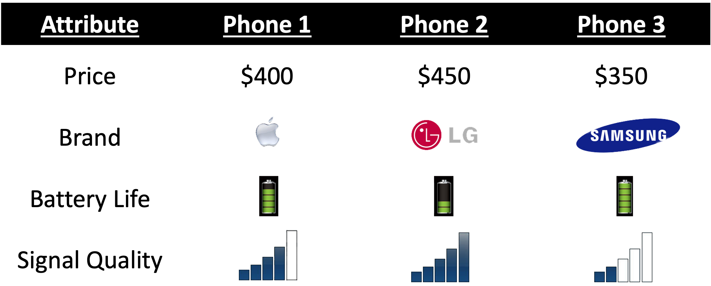
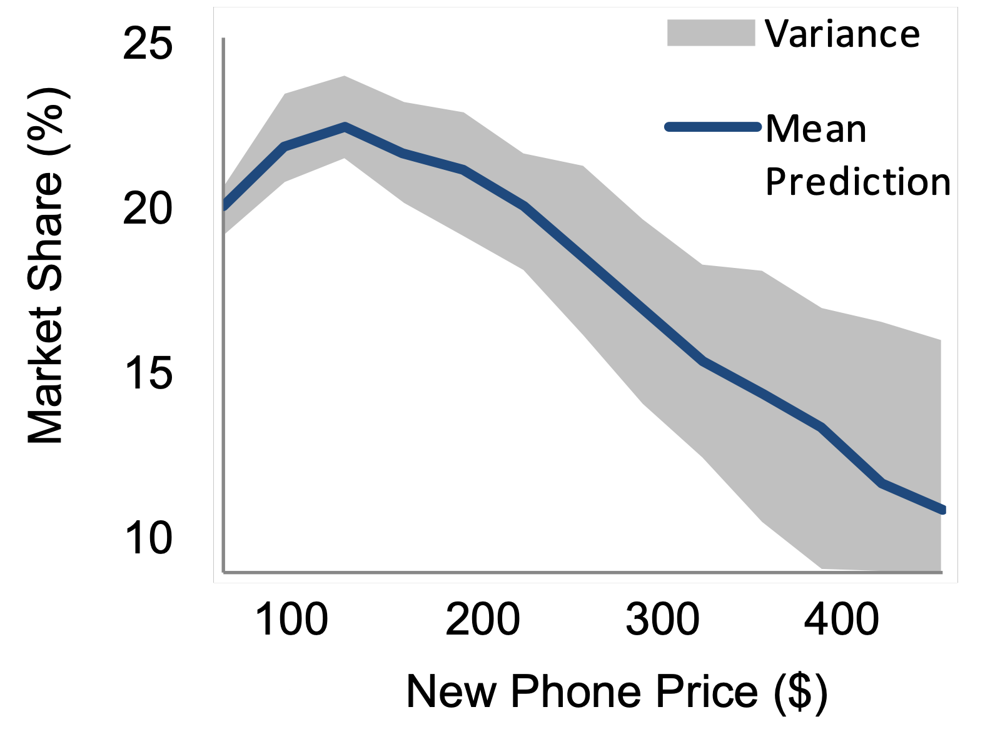

```{r setup, include=FALSE}
library(knitr)
library(tidyverse)
library(fontawesome)
library(metathis)

options(
  htmltools.dir.version = FALSE,
  knitr.table.format = "html",
  knitr.kable.NA = '',
  dplyr.width = Inf,
  width = 250
)

knitr::opts_chunk$set(
  cache = FALSE,
  warning = FALSE,
  message = FALSE,
  fig.path = "figs/",
  fig.width = 7.252,
  fig.height = 4,
  comment = "#>",
  fig.retina = 3
)

# Setup xaringanExtra options
xaringanExtra::use_xaringan_extra(c(
  "tile_view", "panelset", "clipboard", "share_again"))
xaringanExtra::style_share_again(share_buttons = "none")
xaringanExtra::use_extra_styles(
  hover_code_line = TRUE,
  mute_unhighlighted_code = FALSE
)

# Set up website metadata
meta() %>%
  meta_general(
    description = rmarkdown::metadata$subtitle,
    generator = "xaringan and remark.js"
  ) %>%
  meta_name("github-repo" = "jhelvy/2023-qux-conf-conjoint") %>%
  meta_social(
    title = rmarkdown::metadata$title,
    url = "https://jhelvy.github.io/2023-qux-conf-conjoint/",
    og_type = "website",
    og_author = "John Paul Helveston",
    twitter_card_type = "summary_large_image",
    twitter_creator = "@johnhelveston"
  )
```

layout: true

---

class: middle, inverse

.leftcol40[

<center>

</center>

]

.rightcol60[

### `r fontawesome::fa(name = "user", fill = "white")` `r rmarkdown::metadata$author`
### `r fontawesome::fa(name = "university", fill = "white")` `r rmarkdown::metadata$institute`
### `r fontawesome::fa(name = "calendar-alt", fill = "white")` `r rmarkdown::metadata$date`

]

---

# .center[Target audience]

--

## You are familiar with:

<br>

## - Conjoint analysis / discrete choice experiments

--

## - Choice modeling / utility models

--

## - R / programming in general

---

class: center, middle

# Install Software!

### https://jhelvy.github.io/2023-qux-conf-conjoint/software

---

name: background

# Hello World!

.leftcol30[.circle[


]]

.rightcol70[

### John Helveston, Ph.D.

.font80[

Assistant Professor, Engineering Management & Systems Engineering

- 2016-2018 Postdoc at [Institute for Sustainable Energy](https://www.bu.edu/ise/), Boston University
- 2016 PhD in Engineering & Public Policy at Carnegie Mellon University
- 2015 MS in Engineering & Public Policy at Carnegie Mellon University
- 2010 BS in Engineering Science & Mechanics at Virginia Tech
- Website: [www.jhelvy.com](http://www.jhelvy.com/)

]]

---

class: center

## Technology Change Lab

> I study how consumers, firms, markets, and policy affect technological change, with a focus on accelerating the transition to low-carbon technologies

.leftcol[

### .center[Electric & Sustainable Vehicle Technologies]

<center>

</center>

]

.rightcol[

### .center[Market & Policy Analysis]

<center>

</center>

]

---

background-color: #000
class: center, middle, inverse

# How can you find out know what people want?

<center>

</center>

---

class: center, middle 

## Which feature do you care more about?

<center>

</center>

.cols3[

## .center[Battery Life?]

<center>

</center>

]

.cols3[

## .center[Brand?]

<center>

</center>

]

.cols3[

## .center[Signal quality?]

<center>

</center>

]

---

class: center

## **Conjoint Analysis**:
## Use choice data to model preferences

<center>

</center>

---

### .center[Use random utility framework to predict probability of choosing phone _j_]

<br>

--

### 1. $u_j = \beta_1\mathrm{price}_j + \beta_2\mathrm{brand}_j + \beta_3\mathrm{battery}_j + \beta_4\mathrm{signal}_j + \varepsilon_j$

--

### 2. Assume $\varepsilon_j \sim$ iid Gumbel distribution

--

### 3. Probability of choosing phone _j_: $P_j = \frac{e^{\beta'x_j}}{\sum_k^J e^{\beta'x_k}}$

--

### 4. Estimate $\beta_1$, $\beta_2$, $\beta_3$, $\beta_4$ via maximum likelihood estimation 

---

class: center 

.leftcol[.center[

## **Willingness to Pay**

<br>

.font140[Respondents on average are willing to pay $XX to improve battery life by XX%]

]]

--

.rightcol[

## **Make predictions**

### $P_j = \frac{e^{\hat{\beta}'x_j}}{\sum_k^J e^{\hat{\beta}'x_k}}$

<center>

</center>

]

---

background-image: url("images/software-closed.png")
background-size: cover

## Choice-Based Conjoint **Software**

---

background-image: url("images/software-open.png")
background-size: cover

## Choice-Based Conjoint **Software**


---

class: inverse

<br>

### .center[Back to workshop website: https://jhelvy.github.io/2023-qux-conf-conjoint/]

.footer-large[

.right[

@JohnHelveston `r fa(name = "twitter", fill = "white")`<br>
@jhelvy `r fa(name = "github", fill = "white")`<br>
@jhelvy `r fa(name = "weixin", fill = "white")`<br>
jhelvy.com `r fa(name = "link", fill = "white")`<br>
jph@gwu.edu `r fa(name = "paper-plane", fill = "white")`

]]
